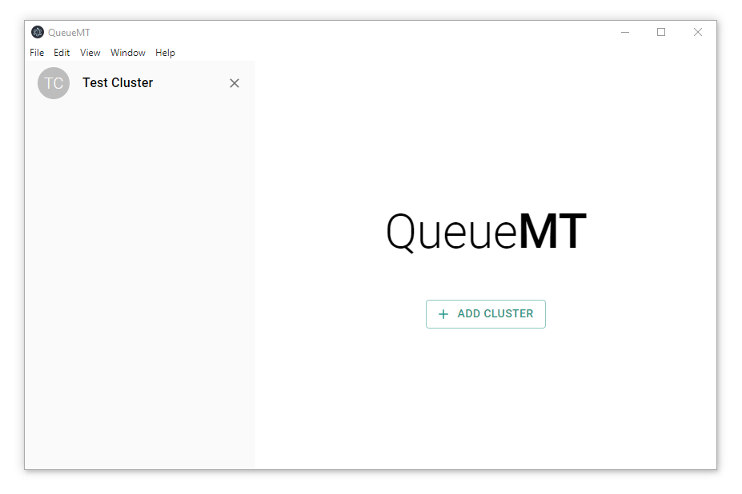
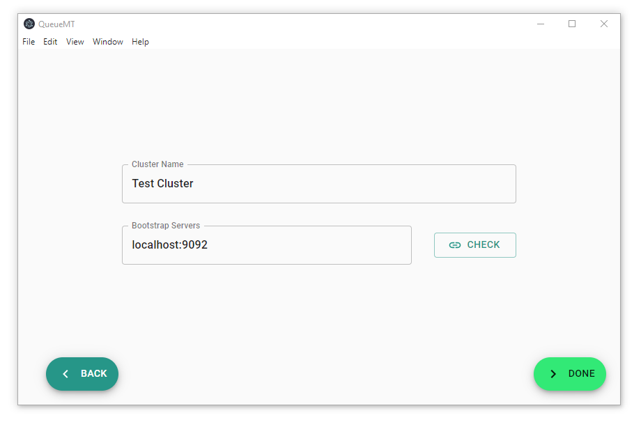
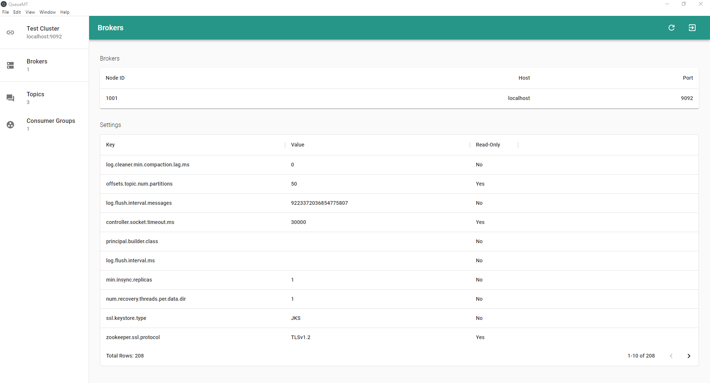
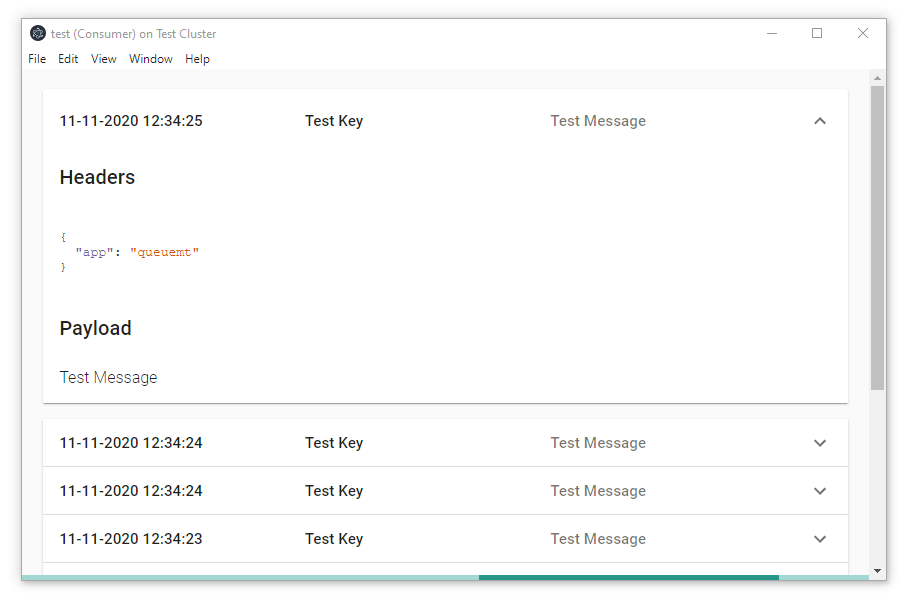
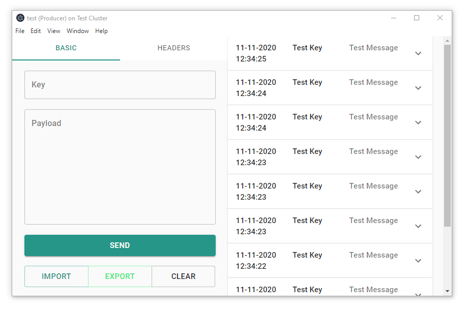

# QueueMT
An open-source tool for managing kafka brokers and clusters.


## Inspiration 🚀

To be able to do some manual testing during the development of our __big data analytics__ projects, we needed a tool to manage our Kafka brokers, reading/writing messages from/to the Topics of our Kafka clusters. No tool met our needs, so we decided to develop one ourselves.


## Features 🧰

* Configuration of the Kafka Broker / Cluster via the user interface.
* Overview of the Kafka Cluster
* Listing of:
  * partitions
  * consumers
  * consumer groups
  * topics
  * settings
* Reading/writing messages from/to Topics
* import and export of requests
* support of authentication via:
  * username / password


## Screenshots 📸

### Landing Screen


### Cluster Creation


### Cluster Overview


### Consumer


### Producer



&nbsp;

## Usage 🔧


### Development 👾

If you want to either contribute to QueueMT and setup an developement environment or build the binaries by yourself, follow these steps:

#### Prequirements:

* NodeJS >= 14
* yarn (```npm i -g yarn```)

#### 1. Clone the repository

```
git clone https://github.com/empolis/queuemt
```

#### 2. Install the required packages

```
yarn
```

#### 3. Start the development environment

```
yarn dev
```

After this you'll have an "ready-to-edit" development environment

&nbsp;
### Building binaries 🔨

#### 1. Make sure tests are passing

```
yarn test
```

#### 2. Build binaries for Windows, Linux and macOS

```
yarn package
```

You'll find the binaries inside the __./build__ folder.

&nbsp;
## Contribution 🙏


If you want to contribute to QueueMT, you can either create an [__Issue__](google.de)
to point out an error or open a [__Pull-Request__](google.de) to make the code
better.


### Pull-Request ❤️

If you want to contribute to the code, please ensure that the following steps
are done before opening your __Pull-Request__:

#### 1. Format the code properly

```
yarn format
```

#### 2. Run the tests and make sure they're passing

```
yarn test
```


___If everything went fine, you're ready to go.___

&nbsp;
## Built with ✨

- [__Electron__](https://www.electronjs.org/) - Electron is a framework that enables you to create desktop applications with JavaScript, HTML, and CSS.
- [__React__](https://reactjs.org/) - React makes it painless to create interactive UIs.
- [__Material-UI__](https://material-ui.com/) - Material-UI is a simple and customizable component library to build faster, beautiful, and more accessible React applications.
- [__KafkaJS__](https://kafka.js.org/) - KafkaJS, a modern Apache Kafka client for Node.js.

&nbsp;
## Built by Empolis 👷


__Empolis__ is the leading provider of __Smart Information Management software__. Many notable national and international companies and public sector institutions rely on Empolis solutions, based on more than 25 years of industry and process experience.

The __Empolis Intelligent Views Platform®__ provides you with an easy way to capture all information and sources in knowledge-intensive processes across the entire lifecycle, link them together and share them with others in a trustworthy manner.

Using our __Empolis AI__, you'll be able to _make better decisions faster_.
